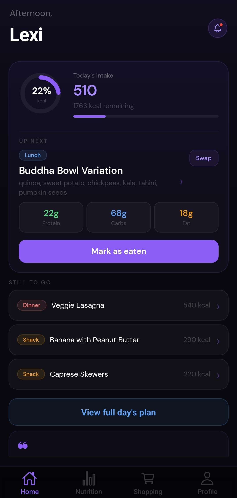
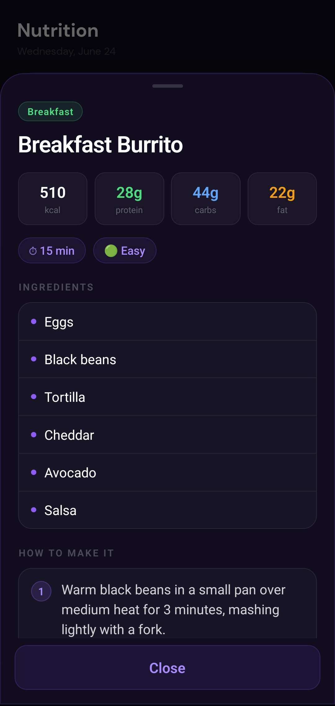
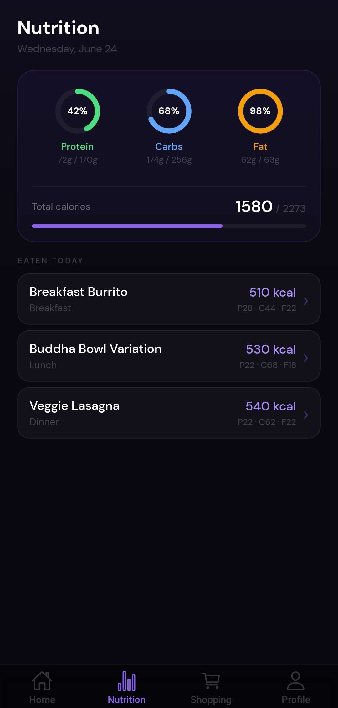
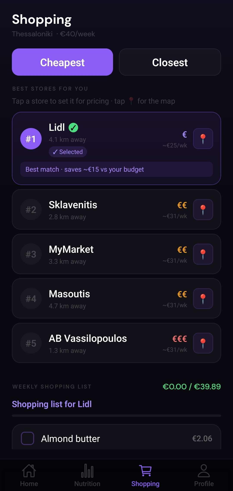
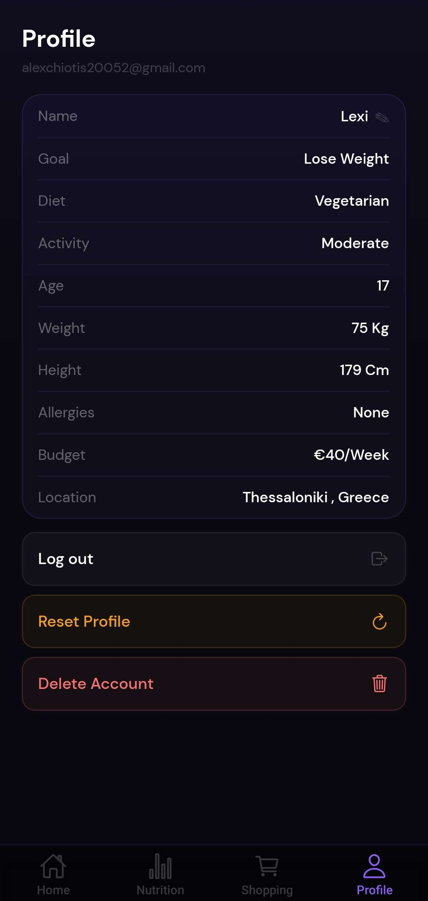

# Mealer

**Personalized weekly meal plans, nutrition tracking, and smart grocery shopping — in your pocket.**


## 📱 About

Mealer is a React Native mobile app that builds personalized weekly meal plans from your goals, body metrics, diet preferences, and budget — then turns them into a shoppable ingredient list with local supermarket guidance. It's built as a portfolio project demonstrating full-stack mobile development: Expo Router navigation, Supabase auth and persistence, constraint-based meal generation in TypeScript, and a polished custom UI without relying on a component library.

## ✨ Features

### Onboarding & Profile

- **12-step onboarding wizard** — collects display name, fitness goal, gender, age, weight, height, activity level, diet type, allergies, weekly budget, and location (`app/(onboarding)/index.tsx`, `contexts/OnboardingContext.tsx`)
- **Supabase-backed profiles** — onboarding data persisted via `upsertProfile` in `lib/profile.ts` and synced through `contexts/AuthContext.tsx`
- **Profile management** — view onboarding answers, inline display name editing, profile reset, and full account deletion (`app/(tabs)/profile.tsx`)

### Meal Planning

- **Constraint-based meal generation (no AI)** — selects from 100+ curated templates in `lib/mealTemplates.ts`, filtered by diet and allergies, sized to a daily calorie target via Mifflin-St Jeor BMR in `lib/calories.ts` (`lib/mealGenerator.ts`)
- **Weekly plans with variety** — `generateWeeklyPlan` in `lib/weeklyMealPlan.ts` builds seven independent days; plans cache in Supabase and AsyncStorage, regenerating when the week rolls over (`lib/mealPlanStorage.ts`)
- **Calorie-aware slot filling** — Monte Carlo selection across breakfast, lunch, dinner, and snack slots, with extra-meal fallback when totals fall short of target
- **Meal swap** — one-tap replacement for any slot on the Home screen without regenerating the full week

### Daily Experience

- **Home dashboard** — time-based greeting, animated calorie intake ring, next-meal highlight, eaten-meal tracking, and daily motivation quote (`app/(tabs)/index.tsx`)
- **Meal detail modals** — bottom-sheet views with macros, ingredients, and step-by-step cooking instructions (`components/MealDetailModal.tsx`)
- **Full-day plan modal** — browse all meals for today in one view (`components/DayPlanModal.tsx`)

### Nutrition

- **Animated macro rings** — protein, carbs, and fat progress rings built with `react-native-svg` and the Animated API, updating as meals are marked eaten (`app/(tabs)/nutrition.tsx`)
- **Cross-tab sync** — eaten-meal state shared between Home and Nutrition via AsyncStorage

### Shopping & Supermarkets

- **Weekly ingredient checklist** — deduplicated shopping list with checkable items and estimated costs scaled to your budget (`lib/ingredientList.ts`, `app/(tabs)/shopping.tsx`)
- **Supermarket ranking** — sort by cheapest (price tier) or closest (distance estimate) using static chain data for Greece, UK, and Germany (`constants/supermarkets.ts`)
- **Interactive store map** — Leaflet.js map embedded in a WebView showing real store coordinates for Thessaloniki (with a smaller Athens fallback set) (`components/SupermarketMapModal.tsx`, `constants/supermarketLocations.ts`)

> **Note:** Supermarket distances are currently simulated (`mockDistanceKm` in `constants/supermarkets.ts`), and grocery prices use static tier multipliers — not live API data. See [Roadmap](#️-roadmap).

### Design & UX

- **Custom violet dark theme** — `#8b5cf6` accent on `#09090f` background with DM Sans typography (`constants/colors.ts`)
- **Smooth animations throughout** — fade/slide transitions, spring bottom sheets, and staggered ring animations via React Native's Animated API

## 🛠️ Tech Stack

| Category | Technology |
|---|---|
| Framework | React Native + Expo SDK 54 |
| Language | TypeScript |
| Navigation | Expo Router ~6 (file-based routing) |
| Backend | Supabase (Auth + PostgreSQL) |
| State | React Context API |
| Animations | React Native Animated API + `react-native-svg` |
| Maps | Leaflet.js via `react-native-webview` |
| Storage | AsyncStorage (local) + Supabase (cloud) |

## 📸 Screenshots

<table>
  <tr>
    <td align="center"><b>Home</b></td>
    <td align="center"><b>Meal Detail</b></td>
  </tr>
  <tr>
    <td></td>
    <td></td>
  </tr>
  <tr>
    <td align="center"><b>Nutrition</b></td>
    <td align="center"><b>Shopping</b></td>
  </tr>
  <tr>
    <td></td>
    <td></td>
  </tr>
  <tr>
    <td align="center" colspan="2"><b>Profile</b></td>
  </tr>
  <tr>
    <td colspan="2" align="center"></td>
  </tr>
</table>

## 🏗️ Architecture

```
app/            → Expo Router screens (file-based routing)
components/     → Reusable UI components
contexts/       → React Context providers (Auth, Onboarding)
lib/            → Business logic (meal generation, calories, storage)
constants/      → Design tokens, static data
types/          → TypeScript type definitions
supabase/       → Database schema (schema.sql)
```

**Routing flow** — `app/_layout.tsx` wraps the app in `AuthProvider` and redirects based on auth status: welcome/login → 12-step onboarding → main tabs.

**Meal planning pipeline** — onboarding profile data flows into `calculateDailyCalorieTarget` (Mifflin-St Jeor equation with goal-based ±500/±300 kcal adjustment). `generateMealPlan` filters templates by diet/allergy constraints, then runs three phases: (1) Monte Carlo slot selection targeting ~8% calorie accuracy, (2) extra snack fallback when under target by >150 kcal, and (3) a hard cap at 115% of target. Each day in the week gets an independent generation pass for variety. Plans persist to the `meal_plans` table keyed by Monday `week_start`, with AsyncStorage mirroring for offline tab access.

## 🚀 Getting Started

### Prerequisites

- Node.js 22+
- Expo CLI (`npx expo` works without a global install)
- A [Supabase](https://supabase.com) project

### Installation

```bash
git clone https://github.com/AlexandrosCh12/Mealer.git
cd Mealer
npm install
```

### Environment Setup

Create a `.env` file in the project root (see `.env.example`):

```
EXPO_PUBLIC_SUPABASE_URL=your_supabase_url
EXPO_PUBLIC_SUPABASE_ANON_KEY=your_supabase_anon_key
```

### Database Setup

Run the following in your Supabase SQL Editor (**Dashboard → SQL → New query**), in order:

**1. Base schema** — run the full contents of [`supabase/schema.sql`](supabase/schema.sql):

- `profiles` table (onboarding fields with check constraints)
- `meal_plans` table (weekly plan JSONB storage)
- Row Level Security policies for both tables
- Index on `meal_plans (user_id, date desc)`

**2. Weekly plan migration** — required by `lib/mealPlanStorage.ts` for week-based caching:

```sql
alter table meal_plans add column if not exists week_start date;
update meal_plans set week_start = date where week_start is null;
alter table meal_plans drop constraint if exists meal_plans_user_id_date_key;
alter table meal_plans add constraint meal_plans_user_id_week_start_key
  unique (user_id, week_start);
```

**3. Account deletion** — required by the delete-account flow in `app/(tabs)/profile.tsx`:

```sql
-- Allow users to delete their own profile row
create policy "Users can delete own profile"
  on public.profiles for delete
  using (auth.uid() = id);

-- RPC to remove the auth.users row after profile/meal_plans are cleared
create or replace function public.delete_own_account()
returns void
language plpgsql
security definer
set search_path = public
as $$
begin
  delete from auth.users where id = auth.uid();
end;
$$;

grant execute on function public.delete_own_account() to authenticated;
```

### Run the App

```bash
npx expo start
```

Press `i` for iOS simulator, `a` for Android emulator, or scan the QR code with Expo Go.

## 🗺️ Roadmap

These are planned enhancements — not yet implemented:

- **Google Places API integration** — replace mock distances in `constants/supermarkets.ts` with real geolocation and expand store data beyond Thessaloniki/Athens
- **Real-time grocery price syncing** — move beyond static price tiers and package-level estimates in `lib/ingredientList.ts`
- **Push notifications** — replace the mock notifications panel on Home (`components/NotificationsPanel.tsx`) with real meal reminders
- **Social features** — share meal plans with friends or family
- **App Store release** — iOS App Store and Google Play deployment

## 🎨 Design Philosophy

Most nutrition apps default to saturated greens and clinical whites — the palette of MyFitnessPal, Lifesum, and dozens of calorie trackers that all feel interchangeable. Mealer deliberately uses a deep violet dark theme (`#09090f` background, `#8b5cf6` accent) to stand apart: it reads as premium and focused rather than medical, and the dark UI reduces eye strain during evening meal planning. Slot-specific accent colors (green breakfast, blue lunch, red dinner, amber snack) provide functional color coding without abandoning the cohesive purple identity.

## 📄 License

This project is for portfolio purposes. Feel free to explore the code and learn from it, but please don't republish it as your own work.

## 👤 Author

**[Your Name]**

- Portfolio: [alexchiotis.dev](https://alexchiotis.dev) *(update with your link)*
- GitHub: [@AlexandrosCh12](https://github.com/AlexandrosCh12)
- LinkedIn: [Your LinkedIn](https://linkedin.com/in/your-profile)

> Fill in your name and social links above before sharing the repo publicly.
